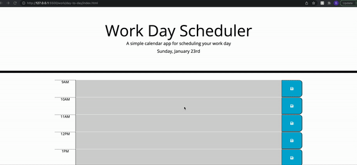

## Table of Contents
- [Task](#task)
- [Day-planner Description](#Day-planner-description)
- [GIF](#gif)
- [Website](#website)

## Task
The purpose of this project is to create a day planner. It is created in html and css and its functionality is through javascript.

## Day-planner Description 
Day to day is a day planner that helps with time efficacy. It is made for standard business hours and the time blocks background colour indicates if it is in the past, present or future based on your local time. You can type your event and it will be saved by clicking the save button in the local storage.

## GIF

  
  
Fig 1: finishing the quiz and entering a name

   

## Website
https://gmadnani.github.io/day-to-day/

https://github.com/gmadnani/day-to-day